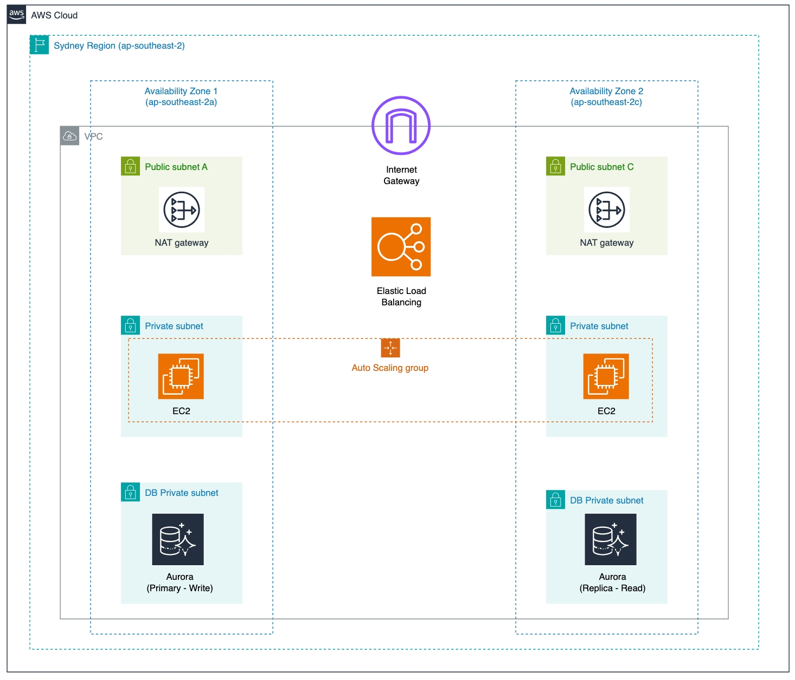

# AWS-Auto-Scaling-Group-Template

This repo is designed to store different templates for different AWS Auto Scaling Group architecture

This AWS architecture template creates a three-tier web application with auto-scaling and load balancing.

This is the three-tier architecture template:

In this repo, you will find in total four templates with different configurations:

1. [Three-tier architecture with Scale Down policy removing 1 instance when CPU < 30% for 120 seconds & Scale Up policy adding 1 instance when CPUUtilization > 50 for 60 seconds](three-tier-1-instance-each-tier.yaml)

## Remove 1 instance when CPU < 30% for 120 seconds & Add 1 instance when CPUUtilization > 50 for 60 seconds

This AWS CloudFormation template creates a three-tier web application architecture that includes:

- A VPC with a CIDR block of 10.10.0.0/16.
- Three public subnets with CIDR blocks 10.10.1.0/24, 10.10.2.0/24, and 10.10.3.0/24.
- An Internet Gateway attached to the VPC.
- A public route table with routes to the Internet Gateway.
- Associations between the public subnets and the public route table.
- An Auto Scaling Group (ASG) with a minimum of 2 instances and a maximum of 5 instances, where instances have Apache installed and a public IP address.
- An Application Load Balancer (ALB) to distribute traffic to the ASG.
- A web server security group allowing inbound HTTP traffic from the ALB.
- A load balancer security group allowing inbound HTTP traffic from anywhere (0.0.0.0/0).
- Scaling policies for the ASG to add an instance when CPU utilization is above 50% for 60 seconds and remove an instance when CPU utilization is below 30% for 120 seconds.
